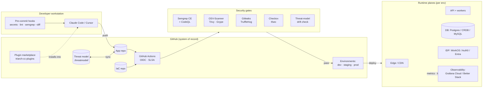
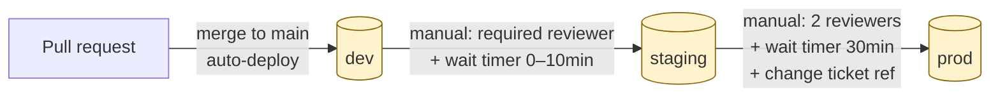
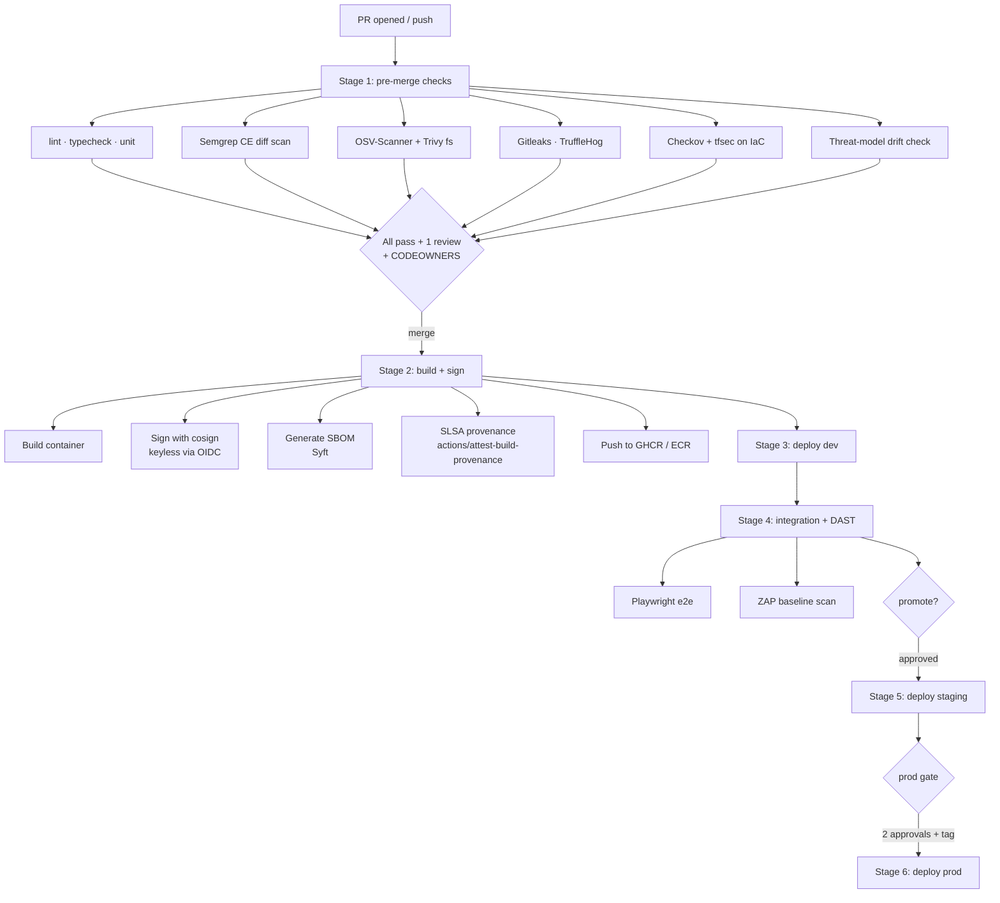
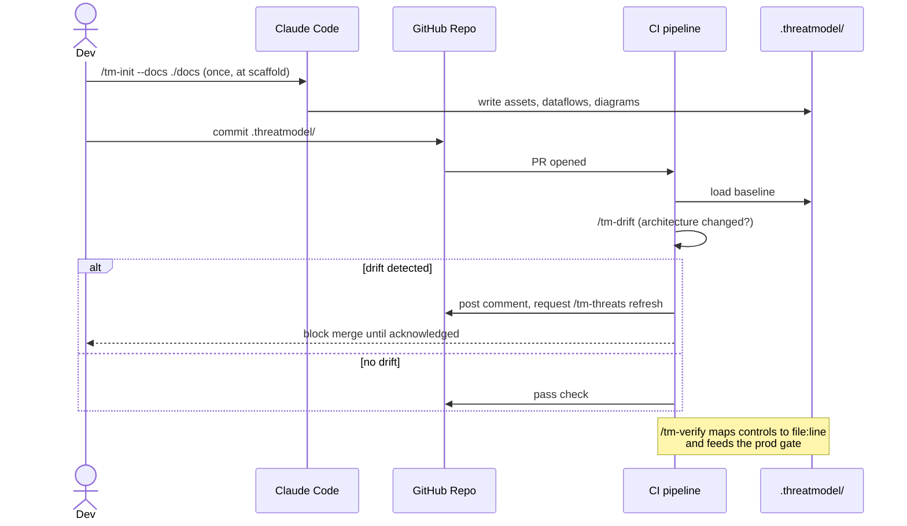
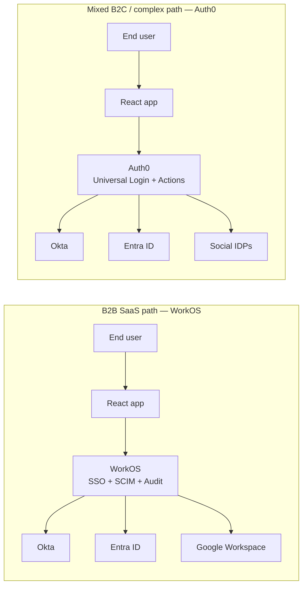
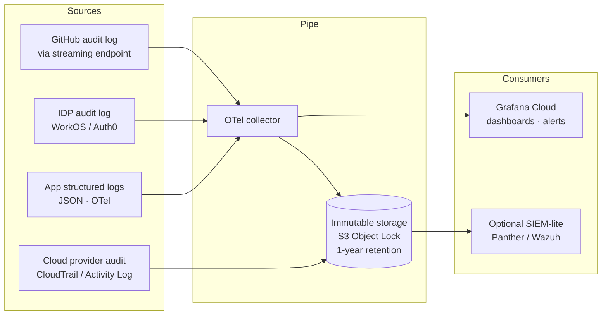
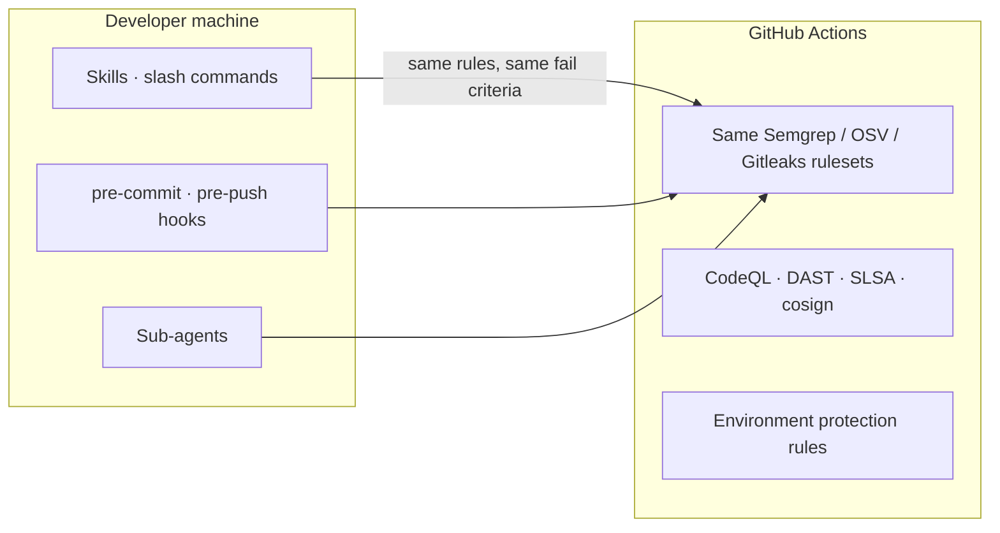
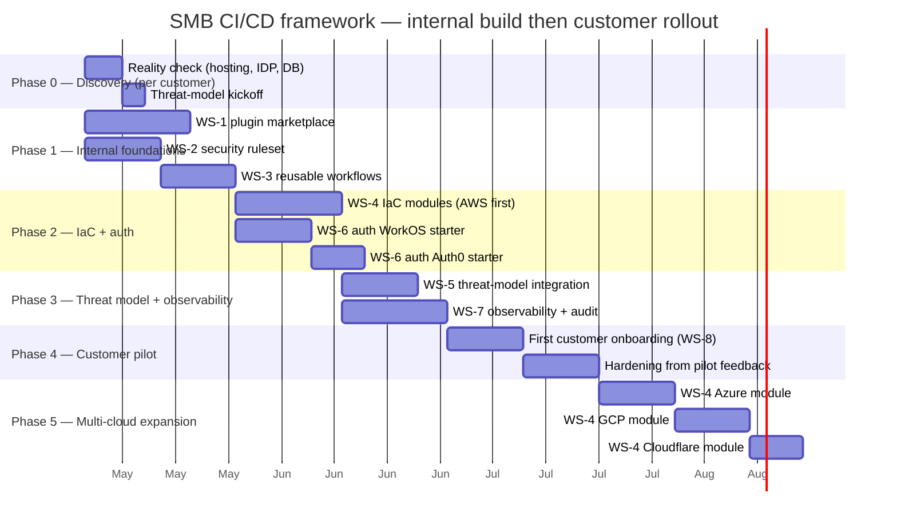

# Generic SMB CI/CD Framework

*A reusable, security-baked, Claude-Code-native pipeline for small and medium business React + variable-backend applications.*

**Status:** Draft v1.0 — framework / scaffold
**Author:** Triarch Security (drafted with Claude)
**Date:** 2026-05-09
**Inspired by:** the `triarch.dev` approach; PAI + GSD-research workflows

---

## 0. How to read this document

This is a **framework**, not a reference implementation. It is opinionated where opinion compresses delivery time, and pluggable where customer realities vary (cloud, database, IDP). Every layer names a primary recommendation and at least one drop-in alternative.

The intended consumer is a Triarch engineer who lands at a customer with a Claude-Code-developed React app and needs to stand up a defensible, audit-ready delivery pipeline in days, not months. The deliverable artefacts described here (plugin marketplace, starter repos, scripts) are the assets we build *once* and re-use *per customer*.

---

## 1. Guiding principles

1. **Security is a left-shifted gate, not a right-shifted audit.** Every dangerous thing — secrets, vulnerable deps, dangerous code patterns, missing controls, untrustworthy build artefacts — is caught before merge or before promotion, not in pen-test season.
2. **The pipeline is the policy.** Anything we say a customer "must do" lives as a workflow file, an environment protection rule, a CODEOWNERS entry, or a Claude Code hook. If it isn't enforceable, it isn't a control.
3. **GitHub is the system of record.** Source code, IaC, threat models, security scan history, approval evidence, and release provenance all live in or pivot off GitHub. Audit reconstruction works from git + GitHub APIs alone.
4. **Claude Code is the developer's seat.** Threat modelling, security review, IaC review, and PR triage happen as slash commands and sub-agents inside the developer's existing IDE — same surface as Cursor for parity.
5. **Cloud-portable, not cloud-promiscuous.** We pick one cloud per customer but design so that a six-month migration is a re-deploy, not a re-architecture.
6. **Evidence over assertion.** Every control claim is backed by a file path, a commit, a workflow run, or a signed attestation.

---

## 2. Reference architecture

### 2.1 Logical components



### 2.2 Layer-by-layer choices

| Layer | Primary (opinionated default) | Alternatives | Why this default |
|---|---|---|---|
| **Source control** | GitHub Team or Enterprise | GitLab, Bitbucket | OIDC to all major clouds, native Environments, Advanced Security ecosystem, plugin/marketplace gravity |
| **CI runner** | GitHub-hosted Actions | Self-hosted Actions on EC2/Fargate (only if customer needs VPC-locked builds) | Lowest setup cost; self-hosted only when policy demands it |
| **IaC** | OpenTofu + Terragrunt | Terraform, Pulumi (TS) | License-stable fork, HCL skill pool, Pulumi if customer prefers TypeScript end-to-end |
| **Frontend host** | Cloudflare Pages | AWS Amplify, Azure Static Web Apps, Vercel | Cheapest TLS-everywhere edge, OIDC-friendly, Workers fill the "tiny backend" gap |
| **Backend compute** | AWS ECS-Fargate behind ALB | Cloudflare Workers, Azure Container Apps, GCP Cloud Run | Predictable cost, OIDC from Actions, SOC2-clean default |
| **Database** | Postgres (RDS or Neon) | CockroachDB Serverless (regional resilience), Supabase (auth+DB combo), MySQL/Aurora if customer-mandated | Postgres = widest tooling + Semgrep/OSV reach; CRDB when uptime SLO demands it |
| **Auth / IDP** | WorkOS (B2B SSO + SCIM) **OR** Auth0 (B2C + complex flows) | Clerk, AWS Cognito, Keycloak (self-host), Entra External ID | WorkOS gives free SAML/SCIM/audit at SMB scale; Auth0 wins where flows are weird |
| **Secrets** | GitHub OIDC → cloud-native KMS/Secrets Manager | HashiCorp Vault (only when customer already runs it) | Eliminates long-lived cloud creds in CI |
| **Observability** | Grafana Cloud free tier (logs/metrics/traces) | Better Stack, Axiom (logs), Datadog SMB | OSS stack underneath, SOC2-attested, no lock-in |
| **Audit log sink** | CloudTrail/Activity Logs → S3/Blob → Grafana Loki | SIEM-lite (Panther, Wazuh) | Cheap, immutable storage; SIEM only when compliance scope expands |

---

## 3. Environment model

### 3.1 Three-track promotion



Three GitHub **Environments** (`dev`, `staging`, `prod`), each owning its own secrets, OIDC trust policy, and protection rules. GitHub allows up to six deployment-protection rules per environment ([docs](https://docs.github.com/en/actions/reference/workflows-and-actions/deployments-and-environments)); we use:

- **dev** — branch restriction (`main` only), no reviewers, smoke-test job is the only gate.
- **staging** — 1 required reviewer (any engineer), prevent-self-review on, 5-minute wait timer for cooling-off, and a hard requirement that the deploying SHA carries SLSA provenance.
- **prod** — 2 required reviewers (one from `@triarch/release-managers` group via CODEOWNERS), prevent-self-review on, 30-minute wait timer, change-ticket reference required in the run input, and the same SLSA + signed-image gate.

Hard separation rules:

- Each environment lives in its own cloud account/subscription/project (account-level blast radius).
- Each environment has its own IDP tenant **or** at minimum its own application registration (no shared client secrets).
- Database per environment; **no** shared DB with row-level filtering.
- Production OIDC trust policy scoped to `repo:<org>/<repo>:environment:prod` and `ref:refs/tags/v*` only. Pre-prod can trust `main` and tags; dev can trust any branch.

### 3.2 Branching

```
main ─────────────────●─────●──────●── tags: v1.4.0 ──> prod
                     /     /      /
feature/* ──●──PR──┘     /      /
                        /      /
hotfix/*  ──●──────────PR─────/
```

Trunk-based, short-lived branches, squash merge, conventional commits, signed commits required (`git config commit.gpgsign true` enforced via repo ruleset). Releases happen by tagging `v*` on `main`; the tag is what triggers the prod environment workflow.

### 3.3 Firebase variant (2-environment model)

The 3-environment AWS/OIDC pattern above is the canonical recommendation. For teams running on **Firebase App Hosting**, a simpler **2-environment** variant (dev + prod, single GCP project, two FAH backends per app) is in use across every Triarch internal project. The pattern preserves the same enforcement properties — branch-gated deploys, GitHub Environment binding on prod, hard bypass prevention — adapted to the constraints of FAH (Console-driven branch wiring, repo-attached package secrets, no per-environment GCP project).

See [firebase-2env-pattern.md](firebase-2env-pattern.md) for the full pattern, including:

- Backend provisioning + Console "Environment Name" field for `apphosting.dev.yaml` auto-overlay
- The shared `deploy-firebase.yml@v7.1` reusable workflow with `dev_backend` input
- The four layers of bypass prevention (branch protection + PR flow + `verify-dev-deployed` CI gate + GitHub Environment branch policy)
- Naming-convention caveats (when the auto-suffix breaks and you need `dev_backend` override)
- Migration playbook from a 1-env setup

If you're greenfielding on AWS, use §3.1. If you're on Firebase or migrating an existing Firebase project, use the variant doc.

---

## 4. Pipeline & security gates

### 4.1 Stages (every PR)



### 4.2 Security tooling stack

Semgrep CE is the spine, but it is **not sufficient on its own** — Supply Chain (SCA) and Secrets are paid Semgrep tiers, so we augment with OSS for those layers ([Semgrep pricing 2026](https://semgrep.dev/pricing/)).

| Concern | Tool (default) | Notes |
|---|---|---|
| SAST — application code | **Semgrep CE** with `p/ci`, `p/owasp-top-ten`, `p/react`, `p/typescript`, `p/javascript`, `p/nodejs` rule packs, plus a Triarch-maintained ruleset | Run `--diff-aware` on PRs for speed, full scan nightly |
| SAST — depth (semantic) | **GitHub CodeQL** (free for public, included in Advanced Security) | Catches what pattern-based rules miss; runs nightly |
| SCA — dependencies | **OSV-Scanner** primary, **Trivy fs** secondary | Both free; Trivy doubles as container/IaC scanner |
| SCA — license | **Syft** SBOM + a license-policy job | Block GPL-3 / AGPL into prod by default |
| Secrets | **Gitleaks** in pre-commit + Actions, **TruffleHog** verified-mode in nightly | Defence in depth; verified-mode catches real live keys |
| IaC | **Checkov** + **tfsec** | Run on every IaC change |
| Container | **Trivy image** + **Grype** | Run after build, before push |
| DAST | **OWASP ZAP baseline** in dev/staging | Gated, low-noise; full active scan only on demand |
| Provenance | **`actions/attest-build-provenance`** + **cosign** | Prod refuses to deploy unsigned/un-attested artefacts |
| Policy | **OPA / Conftest** on Kubernetes/IaC plans (when Kubernetes is in scope) | Optional; only for customers running EKS/AKS/GKE |

> **Supply-chain hardening — non-negotiable:** every third-party Action is pinned to a full-length commit SHA, never a tag. The March 2026 `aquasecurity/trivy-action` tag-hijack ([CrowdStrike write-up](https://www.crowdstrike.com/en-us/blog/from-scanner-to-stealer-inside-the-trivy-action-supply-chain-compromise/)) confirmed why: workflows referencing actions by SHA were unaffected; tag-referencing workflows leaked cloud creds. Dependabot is configured to bump SHAs and update the trailing `# v1.2.3` comment together. Org-level "allowed actions" policy enforces SHA pinning ([GitHub changelog Aug 2025](https://github.blog/changelog/2025-08-15-github-actions-policy-now-supports-blocking-and-sha-pinning-actions/)).

### 4.3 Failure semantics

| Finding severity | PR check | Pre-prod | Prod |
|---|---|---|---|
| Critical / High | **Block merge** | Block deploy | Block deploy |
| Medium | Warn + label `needs-triage` | Warn | Block deploy unless waiver issue is open and approved by `@triarch/security` |
| Low / Info | Comment only | Comment | Comment |

Waivers live as GitHub Issues with a fixed template (CVE/CWE id, blast radius, compensating control, expiry date). Expired waivers re-block prod automatically via a nightly job.

---

## 5. Threat-model integration

### 5.1 Recommended skill / plugin

We recommend installing the open-source **Threat Modeling Toolkit** Claude Code plugin ([josemlopez/threat-modeling-toolkit](https://github.com/josemlopez/threat-modeling-toolkit)) into both the customer's Claude Code session and our internal Claude Code marketplace. It ships nine slash commands (`/tm-init`, `/tm-threats`, `/tm-verify`, `/tm-compliance`, `/tm-report`, `/tm-drift`, `/tm-tests`, `/tm-status`, `/tm-full`) that produce a `.threatmodel/` directory in the repo, mapping STRIDE threats and OWASP/SOC2 controls to file-and-line evidence in the codebase.

A second open-source option to evaluate is `sethdford/claude-skills` (STRIDE skill) — useful if we want a lighter-weight skill rather than a full toolkit.

If neither covers a customer's regulatory footprint, we fork the toolkit into our marketplace (Section 9) and extend it. We do **not** want to build threat modelling from scratch.

### 5.2 Pipeline hooks



### 5.3 Where threat-model output enters the gates

- **Pre-merge:** drift check fails the build if architecture changed without a refreshed model.
- **Pre-prod:** every Critical-severity threat must have a `controls.json` entry marked `Implemented` *with* file-and-line evidence, or a waiver issue.
- **Prod:** OWASP coverage % and SOC2 coverage % from `compliance.json` are surfaced in the deployment summary so the human reviewer sees them at the moment of approval.

---

## 6. Authentication architecture

### 6.1 Required surface

Every customer app must support, by default:

- **Username + password** with bcrypt/argon2id, breached-password check, lockout policy.
- **TOTP / WebAuthn 2FA** — passkeys preferred, TOTP fallback.
- **IDP federation** — SAML 2.0 + OIDC, with SCIM for provisioning. Must work with Okta, Entra ID, and Google Workspace out of the box.
- **Session management** — short-lived access token, refresh-token rotation, device/session listing, server-side revocation.

### 6.2 Two reference stacks



| Use case | Recommendation | Why |
|---|---|---|
| B2B SaaS where customers demand SSO/SCIM | **WorkOS** | SAML, OIDC, SCIM, audit logs, generous free tier (up to 1M MAU on essentials), passkeys included on every tier ([WorkOS positioning](https://workos.com/)) |
| B2C app or unusual auth flows (progressive profiling, custom MFA, machine-to-machine) | **Auth0** | Most extensible policy engine, broadest SDK coverage |
| AWS-native shop, scale-out economy is the deciding factor | **AWS Cognito** | Pricing flattens at high MAU; only pick if customer already standardised on AWS IAM Identity Center |
| Self-hosted / data-residency mandate | **Keycloak** behind WAF | Last resort — operational burden is real |

We do **not** recommend Clerk for customers with enterprise-buyer pipelines: SCIM is not natively supported as of 2026 ([Scalekit comparison](https://www.scalekit.com/blog/workos-alternatives)), which becomes a procurement blocker.

### 6.3 Auth controls inside the pipeline

- IDP tenant per environment; secrets stored only in GitHub Environment secrets, retrieved via OIDC where the IDP supports it (WorkOS does; Auth0 via M2M client credentials in vault).
- A nightly Action runs an auth-smoke job: forces SAML round-trip, asserts MFA enforced for break-glass admin, exports the audit log delta into Loki.
- Break-glass admin accounts: hardware-key-only, separate identity, rotation policy enforced as a scheduled Action.

---

## 7. Audit logging & observability

### 7.1 Three log streams, one pipe



### 7.2 What gets logged (minimum bar)

- All authentication events (success, failure, MFA challenge, IDP federation).
- All authorisation decisions on sensitive resources.
- All admin actions (config change, user role change, secret rotation).
- All deployment events (workflow run id, actor, SHA, environment, approver IDs).
- All data-export events (download, report generation, API bulk read).

Each event carries: `timestamp`, `actor.id`, `actor.type`, `action`, `resource`, `outcome`, `request_id`, `ip`, `user_agent`, `tenant_id`. Schema-validated at ingest.

### 7.3 Observability stack

Default: **Grafana Cloud** free tier (logs via Loki, metrics via Prometheus, traces via Tempo). It is SOC2-attested, OSS-underpinned, and avoids lock-in. Drop-in alternatives: **Better Stack** for log-heavy customers, **Axiom** for ingest-everything-no-sampling shops, **Datadog** if the customer already pays for it.

For SLOs we ship a starter dashboard: API p95 latency, auth success rate, deploy frequency, change failure rate, MTTR — i.e. DORA + DORA-S (security DORA: % deploys with critical findings, mean-time-to-remediate-critical, % builds with provenance).

---

## 8. Multi-cloud reality check

The customer self-reports hosting in **GoDaddy**. For a Claude-Code-developed React app with a real backend and a real DB, GoDaddy shared/managed hosting is implausible — most likely they mean a domain registered there with hosting actually elsewhere (Vercel/Netlify on the front, possibly Heroku or a small VPS on the back). **Investigation step: confirm reality before designing the migration.** Action item in Phase 0.

Per-cloud landing recipes (we maintain these as IaC modules in our marketplace):

| Cloud | Frontend | Backend | DB | Notes |
|---|---|---|---|---|
| **AWS** | Cloudflare Pages or S3+CloudFront | ECS-Fargate behind ALB | RDS Postgres or Aurora | OIDC from Actions to AWS is best-trodden path |
| **Azure** | Azure Static Web Apps | Container Apps | Azure Database for Postgres Flexible | Entra-native, good for customers already on M365 |
| **GCP** | Cloud Storage + Cloud CDN | Cloud Run | Cloud SQL or AlloyDB | Cheapest "scale to zero" backend |
| **Cloudflare-only** | Pages | Workers | D1 (SQLite at edge) or Hyperdrive→Postgres | Lowest cost; works for read-heavy SMB apps |

The IaC module names, inputs, and outputs are normalised so that customer A's `staging` and customer B's `staging` look the same to the pipeline — only the backing module differs.

---

## 9. Claude Code / Cursor integration

### 9.1 The `triarch-cc-plugins` marketplace

We ship a single Claude Code plugin marketplace repo (`github.com/triarch/triarch-cc-plugins`) that customers add with one command:

```
/plugin marketplace add triarch/triarch-cc-plugins
/plugin install triarch-secure-pipeline@triarch
```

Bundled inside:

| Component | Type | What it does |
|---|---|---|
| `triarch-secure-pipeline` | Plugin (entry point) | Pulls in everything below |
| `/security-review` | Slash command | Runs Semgrep + OSV + Gitleaks against the diff and posts a structured review |
| `/threat-model` | Slash command | Wraps the `josemlopez/threat-modeling-toolkit` flow with our defaults |
| `/iac-review` | Slash command | Runs Checkov + tfsec against the IaC diff and explains findings |
| `/release` | Slash command | Cuts a release: bumps version, generates changelog, opens prod-promotion PR |
| `appsec-reviewer` | Sub-agent | Read-only deep-dive reviewer for security-sensitive PRs (auth, crypto, deserialisation, file upload) |
| `pipeline-doctor` | Sub-agent | Diagnoses failed Actions runs and proposes the fix |
| `pre-commit` | Hook | Blocks commits with secrets or hard-coded creds before they leave the laptop |
| `pre-push` | Hook | Runs Semgrep diff-mode and Gitleaks before push |

### 9.2 Cursor parity

Cursor honours the same `.claude/` layout for skills/commands and supports MCP servers natively as of 2026. The same plugin marketplace repo is consumed by Cursor via its MCP and rules import. The customer's choice of IDE does not change the pipeline.

### 9.3 What lives client-side vs server-side



**Rule:** the same finding must produce the same verdict locally and in CI. We achieve this by versioning rulesets in a single repo (`triarch-security-rules`) and consuming them from both Claude Code skills and the Actions workflows. No "works on my machine" security drift.

---

## 10. Approval gate mechanics

| Gate | Mechanism | Evidence captured |
|---|---|---|
| Merge to `main` | Branch ruleset: 1 review, CODEOWNERS, all checks pass, signed commits, linear history | PR record, review IDs, check-run IDs |
| `dev → staging` | Environment rule: 1 reviewer (any eng), prevent-self-review, wait timer 5m | Approval event in audit log, run input |
| `staging → prod` | Environment rule: 2 reviewers (1 from `release-managers`), prevent-self-review, wait timer 30m, tag-only ref, change-ticket input required | Approval events, tag ref, change ticket reference |
| Waiver of a security finding | GitHub Issue with template, label `security-waiver`, approval by `@triarch/security` | Issue with structured body, expiry date, linked PR |
| Break-glass deploy | Manual workflow dispatch with `--break-glass=true` input requires step-up MFA at IDP and posts to a public-by-default channel | IDP step-up event, Slack notification, post-mortem ticket auto-created |

Every gate produces structured audit events that flow into the `Pipe` in §7.1, queryable by `actor.id`, `environment`, `outcome`.

---

## 11. What I'd add that wasn't on the list

Things the brief did not call out that I'd hard-recommend:

1. **Signed commits + signed releases.** Closes the impersonation loophole that environment rules don't.
2. **SLSA build provenance + cosign keyless.** Without this, "the right code got promoted" is an assertion, not a proof. Cheap to add — `actions/attest-build-provenance` + cosign verify in the deploy step.
3. **Dependabot + Renovate with SHA-aware updates.** Mandatory after the March 2026 trivy-action incident.
4. **Production data-handling boundary.** A documented rule that production data never enters non-prod, plus an automated check for prod connection strings in non-prod env files.
5. **Disaster-recovery runbook + restore drill.** SMBs forget this until they need it. Quarterly automated restore from prod backup into a throwaway staging.
6. **Tabletop incident drill, twice a year.** The pipeline is judged by what happens at 03:00 on a Saturday, not by what passes on a Tuesday.
7. **License compliance gate.** Surprise GPL-3 in a closed-source SaaS is a real, recurring SMB problem.
8. **Cost guardrails.** A nightly Action checks cloud spend deltas; > x% week-over-week opens an issue. SMBs can't absorb runaway-bill incidents.
9. **Backup encryption key separation.** The KMS key that encrypts backups must be in an account the production application role *cannot* touch. Otherwise ransomware re-encrypts your backups too.
10. **Privacy / DSAR endpoint scaffolding.** Even small SaaS get GDPR/CCPA requests. A documented user-export and user-delete code path saves the panic later.
11. **Threat-model drift as a first-class CI gate** (already in §5, calling out because it's the lever most often missed).
12. **Plugin-marketplace governance.** Our internal marketplace needs its own CI: signed plugin manifests, SHA-pinned skill scripts, rule that no plugin can introduce a tool with shell access without a PR review by `@triarch/security`. Otherwise we become the supply-chain attack vector.

---

## 12. Workstreams

Eight parallelisable workstreams. Each is owned by one person, has one named output, and one acceptance test.

| # | Workstream | Output | Acceptance test |
|---|---|---|---|
| **WS-1** | Claude Code plugin marketplace (`triarch-cc-plugins`) | Public/private GitHub repo, `/plugin marketplace add` works | Fresh laptop installs the plugin and gets all 4 slash commands working in <5 min |
| **WS-2** | Security ruleset library (`triarch-security-rules`) | Versioned Semgrep + OSV ignore + Gitleaks + Checkov rule packs | Same finding reproduces locally and in CI on the seed app |
| **WS-3** | Reusable GitHub Actions workflows (`triarch-actions`) | Reusable workflows: `secure-build.yml`, `secure-deploy.yml`, `nightly-scan.yml` | A new repo can adopt the pipeline by copying ≤30 lines of caller workflow |
| **WS-4** | IaC modules (`triarch-iac`) | OpenTofu modules: `aws-react-app`, `azure-react-app`, `gcp-react-app`, `cloudflare-react-app`, `auth-workos`, `auth-auth0`, `obs-grafana-cloud` | `tofu apply` from zero stands up dev/staging/prod in any of the 4 clouds |
| **WS-5** | Threat-model integration | Wrapper plugin around `josemlopez/threat-modeling-toolkit` + drift-check Action | Drift check fails CI on a staged architecture change |
| **WS-6** | Auth reference implementations | Two starter repos: `triarch-react-workos`, `triarch-react-auth0`, both with 2FA + IDP + SCIM working | Customer can log in via Okta + enforce 2FA on day 1 |
| **WS-7** | Observability + audit | Grafana Cloud stack-as-code, log shippers, default DORA + security-DORA dashboards, audit log retention to S3 Object Lock | Auditor can answer "who deployed what to prod on date X" in <2 minutes |
| **WS-8** | Customer onboarding kit | Runbook + threat-model template + change-management template + DR drill template + tabletop kit + cost-guardrail Action | A Triarch engineer can stand up a new customer end-to-end in ≤5 working days |

---

## 13. Phased rollout



### Phase descriptions

- **Phase 0 — Discovery (per customer).** Confirm what they actually run (the GoDaddy claim almost certainly hides a more complex reality). Inventory IDP, DBs, who has cloud admin, what's already in GitHub. Output: a one-page "current state" doc and a delta plan.
- **Phase 1 — Internal foundations.** The marketplace, the rule packs, the reusable workflows. Nothing customer-specific. This is the asset we monetise across customers.
- **Phase 2 — IaC + auth.** AWS first because OIDC patterns are most mature. Both auth starters in parallel because we'll need both within the first three customers.
- **Phase 3 — Threat model + observability.** These are bundled because threat-model output (controls.json) flows into observability dashboards (compliance %).
- **Phase 4 — Customer pilot.** First real customer. Treat as design feedback, not production reference. Expect to refactor 20–30% of WS-1/2/3 after this.
- **Phase 5 — Multi-cloud expansion.** Add Azure, GCP, Cloudflare modules driven by customer pull, not speculative build.

---

## 14. Acceptance criteria (definition of "done" for the framework v1)

The framework is shippable to a customer when **all** of these are true:

- [ ] A new repo can adopt secure CI in ≤30 lines of caller workflow.
- [ ] A fresh laptop running Claude Code or Cursor gets the full slash-command suite in ≤5 minutes from `/plugin install`.
- [ ] An auditor reconstructing "what was deployed to prod on day X by whom with what scan results" needs only `gh` CLI + S3 audit bucket — no human SME required.
- [ ] Removing the customer's primary cloud (the disaster scenario) means re-running `tofu apply` against a different module — no code changes in the app repo.
- [ ] A new architecture component (say, adding a Redis) cannot reach prod without the threat model being updated and re-verified.
- [ ] Critical Semgrep / OSV / Gitleaks / Checkov findings cannot be merged without a tracked, expiring waiver.
- [ ] Every prod deploy carries a verifiable SLSA provenance attestation and a cosign signature.
- [ ] 2FA is enforced for every human, hardware-key-only for break-glass admins.
- [ ] DR drill (restore prod backup into staging) runs quarterly via a scheduled Action and produces an archived report.
- [ ] The internal plugin marketplace is itself protected by the same controls (signed manifests, SHA-pinned scripts, security review on tool additions).

---

## 15. Open questions / things to validate before week 2

1. **The GoDaddy claim.** What is *actually* hosting their app? — likely Vercel/Netlify front + something handwavy on the back. Confirm before sizing migration.
2. **Customer compliance scope.** SOC2? PCI? HIPAA? GDPR? CCPA? Each one shifts which OWASP/SAMM levels we target and whether we need a SIEM-lite from day 1.
3. **Existing IDP.** Customer already has Okta? Entra? Google Workspace? Workday? — picks WorkOS vs Auth0 for us in most cases.
4. **Existing GitHub plan.** Free / Team / Enterprise — Advanced Security availability and SAML SSO availability differ.
5. **Cost ceiling.** Grafana Cloud free tier is generous but has limits; Datadog is ~10x cost. Need a number.
6. **Data residency.** EU-only? US-only? Drives cloud region and possibly disqualifies Cloudflare-only path.
7. **Who is on call.** SMBs frequently have nobody. If true, the alerting strategy needs an external 24/7 service, not just a Slack channel.

---

## 16. Sources / reading

- GitHub: [Deployments and environments](https://docs.github.com/en/actions/reference/workflows-and-actions/deployments-and-environments) · [Reviewing deployments](https://docs.github.com/actions/managing-workflow-runs/reviewing-deployments) · [Secure use reference](https://docs.github.com/en/actions/reference/security/secure-use) · [Well-Architected: securing GitHub Actions](https://wellarchitected.github.com/library/application-security/recommendations/actions-security/) · [SHA-pinning policy changelog (Aug 2025)](https://github.blog/changelog/2025-08-15-github-actions-policy-now-supports-blocking-and-sha-pinning-actions/)
- Supply chain: [SLSA framework](https://slsa.dev/) · [actions/attest-build-provenance](https://github.com/actions/attest-build-provenance) · [slsa-github-generator](https://github.com/slsa-framework/slsa-github-generator) · [Trivy-action supply chain incident, March 2026 (CrowdStrike)](https://www.crowdstrike.com/en-us/blog/from-scanner-to-stealer-inside-the-trivy-action-supply-chain-compromise/) · [Same incident, The Hacker News](https://thehackernews.com/2026/03/trivy-security-scanner-github-actions.html)
- SAST/SCA: [Semgrep CE](https://github.com/semgrep/semgrep) · [Semgrep pricing 2026](https://semgrep.dev/pricing/) · [OSS SCA tools comparison 2026](https://appsecsanta.com/sca-tools/open-source-sca-tools) · [aquasecurity/trivy-action](https://github.com/aquasecurity/trivy-action)
- Threat modelling: [josemlopez/threat-modeling-toolkit](https://github.com/josemlopez/threat-modeling-toolkit) · [sethdford/claude-skills (STRIDE)](https://github.com/sethdford/claude-skills/blob/main/security/threat-modeling/skills/stride-analysis/SKILL.md) · [fr33d3m0n/threat-modeling](https://github.com/fr33d3m0n/threat-modeling) · [STRIDE-GPT](https://github.com/mrwadams/stride-gpt)
- Auth: [WorkOS vs Auth0 vs Clerk for B2B SaaS SSO 2026](https://thesaaspodium.com/b2b-saas-sso-guide/) · [Auth0 vs Cognito vs WorkOS](https://workos.com/blog/auth0-vs-cognito) · [WorkOS alternatives](https://www.scalekit.com/blog/workos-alternatives) · [CIAM vendors 2026](https://guptadeepak.com/comprehensive-ciam-providers-directory-top-identity-authentication-solutions/)
- Observability: [Grafana Cloud](https://grafana.com/products/cloud/) · [SMB observability comparison 2026](https://www.ir.com/guides/top-observability-tools-comparison-2026-smbs-vs-enterprise-platforms) · [Open-source observability tools 2026](https://openobserve.ai/blog/top-10-open-source-observability-tools/)
- IaC / GitOps: [IaC best practices 2026](https://dev.to/muskan_8abedcc7e12/infrastructure-as-code-best-practices-terraform-pulumi-and-opentofu-in-2026-4nc1) · [Argo CD vs Flux 2026](https://dev.to/mechcloud_academy/the-gitops-standard-in-2026-a-comparative-research-analysis-of-argocd-and-fluxcd-46d8)
- DBs: [Database free-tier comparison 2026](https://agentdeals.dev/database-free-tier-comparison-2026) · [Neon vs Supabase](https://www.dbpro.app/blog/neon-vs-supabase) · [Top managed Postgres 2026](https://dreamlit.ai/blog/top-10-managed-postgres-providers)
- Frontend deploy: [Vercel vs Netlify vs Amplify](https://betterstack.com/community/guides/scaling-nodejs/vercel-vs-netlify-vs-aws-amplify/) · [Cloudflare React+Vite guide](https://developers.cloudflare.com/workers/framework-guides/web-apps/react/)
- Application security frameworks: [OWASP ASVS](https://owasp.org/www-project-application-security-verification-standard/) · [OWASP SAMM](https://owasp.org/www-project-samm/) · [Using SAMM and ASVS together](https://www.pivotpointsecurity.com/using-owasps-software-assurance-maturity-model-samm-and-application-security-verification-standard-asvs-together/)
- Claude Code: [Plugins reference](https://code.claude.com/docs/en/plugins-reference) · [anthropics/claude-code plugins README](https://github.com/anthropics/claude-code/blob/main/plugins/README.md) · [Claude Code plugins announcement](https://claude.com/blog/claude-code-plugins) · [Claude Code full stack explained](https://alexop.dev/posts/understanding-claude-code-full-stack/) · [awesome-claude-code-plugins](https://github.com/ccplugins/awesome-claude-code-plugins) · [claude-code-plugin-template](https://github.com/ivan-magda/claude-code-plugin-template)
